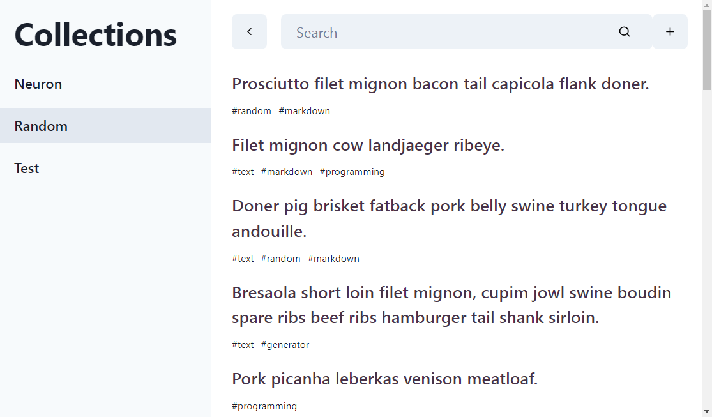
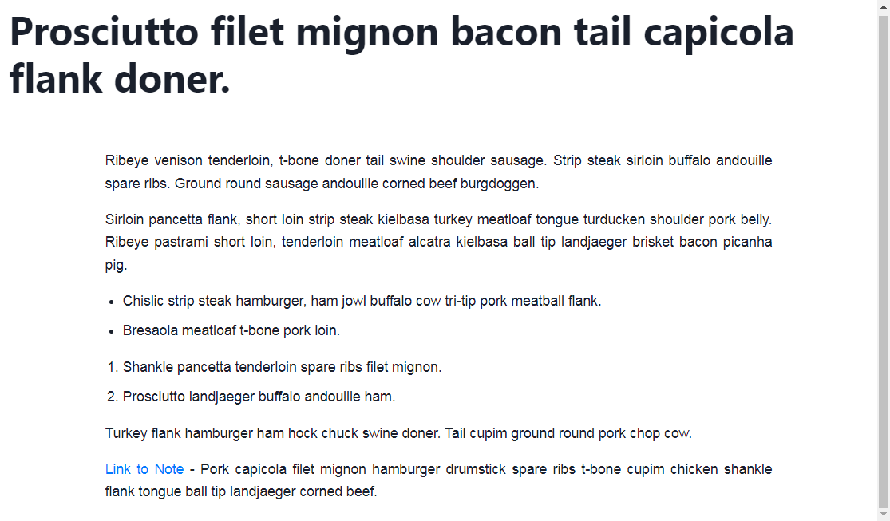
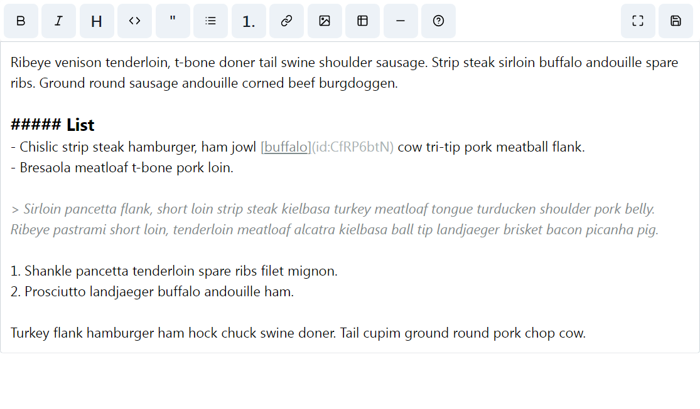

## ReNotes

A zettle-kasten based markdown note-taking that you can selfhost.

### Features

- [x] Collections
- [x] Live Markdown Editing
- [ ] Authentication
- [ ] Public collections
- [ ] Deep Searching
- [ ] Graph

### Self Host

```sh
docker build . -t renotes/renotes
sudo docker-compose up -d
```

### Screenshots





